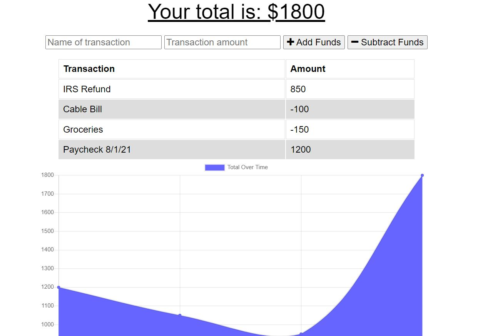
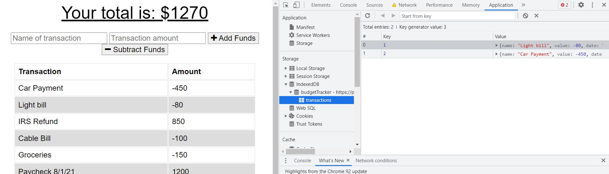
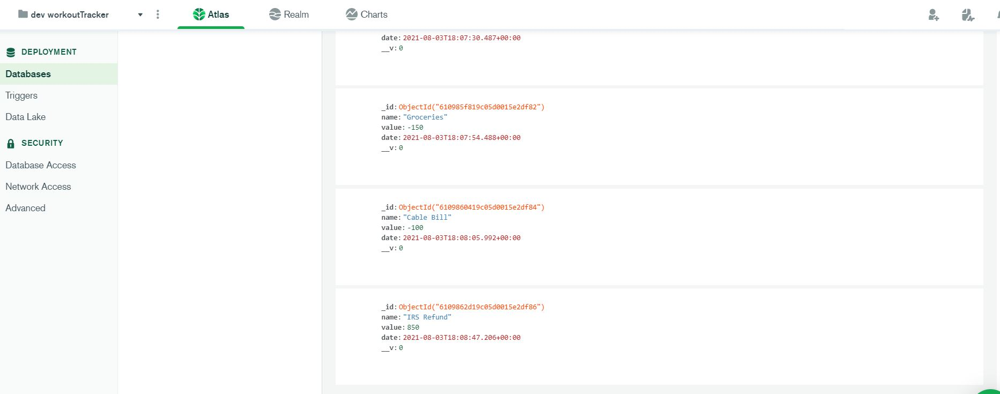
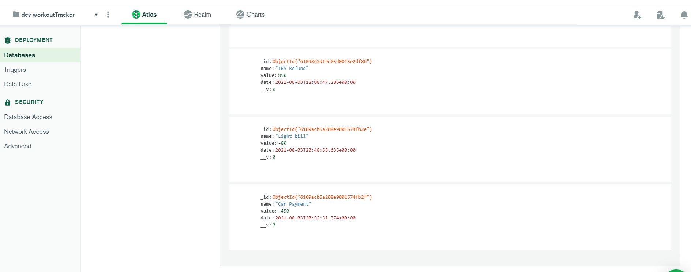

# 💰 BudgetTracker


## 📝Description

```
Budget Tracker is an app that allows you to track your 
expenses and earnings with a running balance. It has the 
ability to work offline if there's no internet connection 
and will sync back up with the database once connectivity
has been restored. 
```

## 🧰 Technologies Used

* `Node.js`
* `npm (Node Package Manager)`
* `Javascript`
* `Mongo Atlas`
* `Mongoose`
* `Express.js`
* `Compression`
* `Morgan`
* `indexedDb`


## 📸 Screenshots

**MAIN PAGE**

> The main image below shows the application with it's saved values along with a chart showing the balance. This data is written to a Mongo Atlas database in the cloud. 



**OFFLINE PAGES**

> When the application detects that it's offline, then all transactions are stored in the browser inside of indexedDb as shown below. 



> While offline, the Mongo Atlas db will not have a record of the last 2 transactions shown on the previous screenshot. Once the application comes back online, these transactions are transferred to Mongo Atlas and the indexedDb in the browser is cleared out. 






## 🔗 Application Links

* [Github](https://github.com/malmason/BudgetTracker)
* [Heroku Deployment](https://protected-temple-93132.herokuapp.com/)

## 📱 Contact 

Malcolm Mason - [Github](https://github.com/malmason) Email: [Malcolm](mailto:malmason66@gmail.com) 📧

---

&copy; 2021 Malcolm Mason