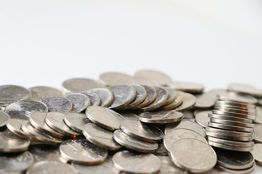

# 💰 BudgetTracker



## 📝Description

```
Budget Tracker is an app that allows you to track your 
expenses and earnings with a running balance. It has the 
ability to work offline if there's no internet connection 
and will sync back up with the database once connectivity
has been restored. 
```

## 🧰 Technologies Used

* `Node.js`
* `npm (Node Package Manager)`
* `Javascript`
* `MongoDB`
* `Mongoose`
* `Express.js`
* `Compression`
* `Morgan`

## 📱 Contact 

Malcolm Mason - [Github](https://github.com/malmason) Email: [Malcolm](mailto:malmason66@gmail.com) 📧

---

&copy; 2021 Malcolm Mason